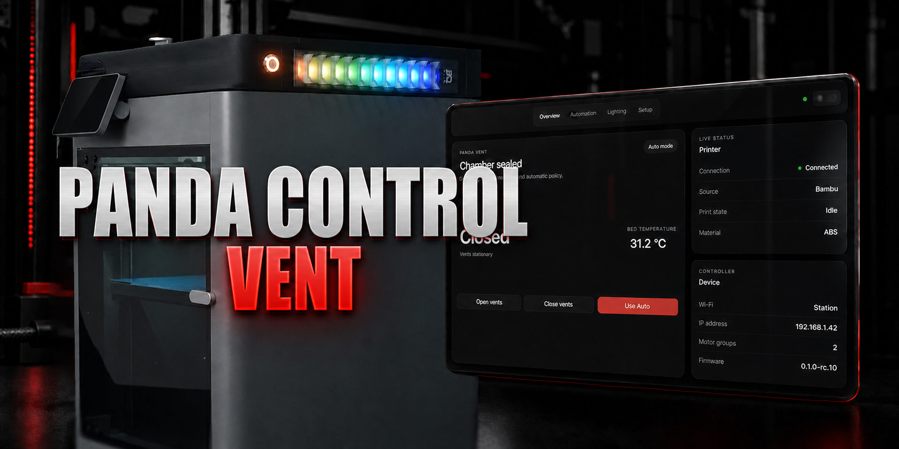

# Panda Control Vent

<p align="center">
  
</p>

<p align="center">
  Community firmware for the BIGTREETECH Panda Vent, developed and hardware-tested by
  <a href="https://extrusiontherapy.com/">Extrusion Therapy</a>.
</p>

<p align="center">
  <a href="https://github.com/rdcstout/panda-control-vent/releases/download/v0.1.0-rc.10/Panda-Control-Vent-0.1.0-rc.10-OTA.bin"><strong>Download RC10 firmware</strong></a>
  ·
  <a href="https://github.com/rdcstout/panda-control-vent/releases/tag/v0.1.0-rc.10">Release notes</a>
  ·
  <a href="https://buy.stripe.com/fZu3cw2Mnfr0d7N3ws1kA00">Support future workshop tools</a>
</p>

> [!IMPORTANT]
> Panda Control Vent is unofficial community firmware. It is not endorsed by
> BIGTREETECH or Bambu Lab. Keep an official stock firmware image available so
> you can return the controller to factory software.

## What it adds

- A complete, responsive embedded interface for control, setup, maintenance,
  recovery, and firmware updates.
- Hardware-tested Bambu LAN support with correct preparing, printing, paused,
  completed, stopped, and idle status behavior. Error parsing and mapping are
  covered by host-side tests; a genuine printer fault was not induced during
  hardware testing.
- Simple commanded-bed-temperature automation for Bambu printers, with the
  inherited advanced material policy retained for Klipper users.
- Independent vent and chamber-light zones. The factory front LED boards can be
  relocated inside the printer and controlled as full-color chamber lighting.
- Separate colors, brightness, effects, speed, error behavior, idle dimming,
  and factory chamber-light following.
- In-place OTA upgrades that preserve compatible DragonVent and Panda Control
  Vent settings.
- Optional setup/recovery access point that remains off while normal Wi-Fi is
  working.

## Tested configuration

Stable release `0.1.0-rc.10` has been used on retail Panda Vent hardware
connected to a Bambu Lab X1C. Real-device testing covers:

- Bambu LAN discovery, binding, reconnect, and live printer telemetry;
- automatic and manual vent operation through complete print cycles;
- preparing, printing, manually paused, completed, stopped, and idle colors;
- a 7.5-second completion indication followed by idle;
- optional idle dimming to 20% after a three-second transition delay;
- factory chamber-light following;
- independent right and left vent/chamber LED zones; and
- OTA updates that retain existing settings.

Klipper/Moonraker support is inherited from DragonVent. It remains available,
but Extrusion Therapy has not independently hardware-tested that path.

## Download and install

Download **[Panda-Control-Vent-0.1.0-rc.10-OTA.bin](https://github.com/rdcstout/panda-control-vent/releases/download/v0.1.0-rc.10/Panda-Control-Vent-0.1.0-rc.10-OTA.bin)**.

The same application image is used when installing over compatible stock
firmware, upgrading DragonVent 0.5.9, or updating Panda Control Vent.

### From compatible stock firmware

1. Download and retain the official Panda Vent stock firmware for recovery.
2. Open the Panda Vent's existing web interface using its IP address.
3. Open the stock firmware-update page and upload the Panda Control Vent OTA
   image.
4. Wait for the controller to restart. Do not disconnect power during the
   update.
5. If the controller was already configured, its network and printer settings
   should remain available. Otherwise, join the generated
   `Panda_Control_Vent_XXXX` setup network and complete setup.

### From DragonVent or Panda Control Vent

Open **Setup → Maintenance → Firmware update**, select the OTA image, and wait
for the interface to confirm that the controller has returned.

Verify a downloaded release with the accompanying `SHA256SUMS` file:

```sh
shasum -a 256 -c SHA256SUMS
```

## Chamber-light modification

Each vent output contains 16 addressable pixels. Hardware probing established
the same zero-based map on both sides:

| Zone | Pixels |
| --- | ---: |
| Main vent lighting | 0–10 |
| Factory front board / relocated chamber lighting | 11–15 |

The front boards already terminate on their respective vent assemblies. No
GPIO or electrical modification is required; the physical modification is
moving those boards into the print chamber. See the
[LED hardware map](docs/LED_HARDWARE_MAP.md) for the tested wiring details.

## Known RC10 limitations

- Factory reset clears network and printer binding, but RC10 retains some
  lighting, calibration, access-point, and local-control settings.
- The embedded service is designed for a trusted local network. It is not an
  internet-facing service and should not be exposed through router port
  forwarding.
- Moonraker support is inherited and unverified by Extrusion Therapy.

## Project lineage and upstream contributions

Panda Control Vent starts from
[DragonVent](https://github.com/justinh-rahb/DragonVent) v0.5.9 at commit
`51d1c1ea09e0f752b030de56f7b7a9b42fda6518`. The original MIT copyright and
license are preserved in [LICENSE](LICENSE), with additional attribution in
[NOTICE](NOTICE).

Our upstream contributions are intentionally narrow: tested corrections that
make DragonVent's existing firmware and interface work reliably with Bambu
printer states. Panda Control Vent's replacement interface, branding,
automation experience, chamber-light hardware map, and every chamber-light
setting remain part of this fork.

See the [upstream contribution plan](docs/UPSTREAM_CONTRIBUTION_PLAN.md) for the
exact inclusion and exclusion boundary.

## Development and release checks

```sh
node --test tests/*.test.mjs
cc -std=c11 -Wall -Wextra -Werror -fsanitize=address,undefined \
  -Ifirmware/components/dc_bambu/include \
  tests/dc_bambu_light_parse_test.c -o /tmp/pcv-bambu-test
/tmp/pcv-bambu-test
python3 scripts/check_upgrade_contract.py
tools/idf-build.sh firmware esp32 build
```

The firmware targets the classic ESP32 using ESP-IDF 5.3.1. The release
workflow rebuilds and tests the source, then publishes the checksum-verified,
hardware-tested OTA image under both versioned and stable filenames.

## Support

Panda Control Vent is free and open source. If it helps in your shop, you can
optionally **[support future Extrusion Therapy tools](https://buy.stripe.com/fZu3cw2Mnfr0d7N3ws1kA00)**.
The firmware and source remain available without payment.

This project is provided as-is without a support contract or warranty.
